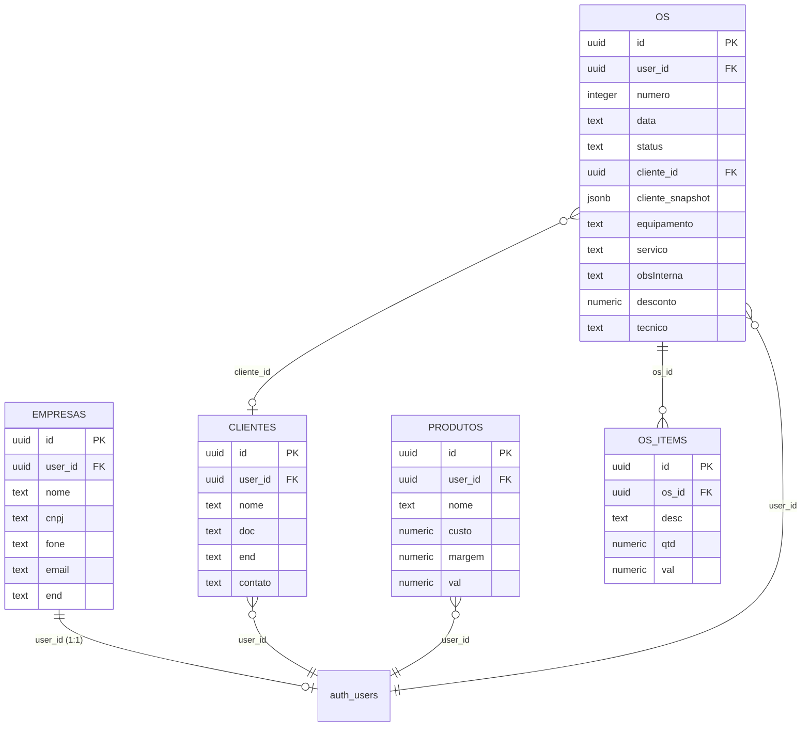

# ⚡ Gerador de OS — Sistema de Ordens de Serviço

<p align="center">
  <strong>Sistema web completo para geração e gestão de Ordens de Serviço (OS), orçamentos e recibos.</strong>
  <br />
  Desenvolvido com React 19 · Vite 8 · Supabase · Tailwind CSS 4
</p>

<p align="center">
  
  
  
  
  
  
</p>

---

## 📋 Visão Geral

O **Gerador de OS** é uma aplicação web progressiva (PWA) voltada para prestadores de serviço, técnicos e pequenas empresas que precisam emitir Ordens de Serviço profissionais de forma rápida e organizada.

O sistema permite cadastrar empresa, clientes e produtos/serviços, criar e gerenciar OS com numeração automática, visualizar a OS em formato A4 pronto para impressão, e acompanhar métricas financeiras através de um painel de controle.

---

## ✨ Funcionalidades

### 🏠 Painel de Controle (Dashboard)
- KPIs em tempo real: OS abertas, concluídas hoje, faturamento mensal e ticket médio
- Indicador de status da conexão com a nuvem
- Ação rápida para criar nova OS

### 📄 Editor de Ordens de Serviço
- Criação e edição completa de OS
- Numeração automática sequencial por usuário (formato `0001/2026`)
- Campos: cliente, equipamento, serviço, observação interna, técnico responsável
- Tabela de itens com quantidade, valor unitário e cálculo automático
- Campo de desconto com cálculo do total final
- Status da OS: Aberta, Em Andamento, Aprovada, Finalizada, Cancelada

### 🖨️ Impressão em A4
- Preview em formato A4 (210mm × 297mm) fiel ao documento final
- Layout profissional com cabeçalho institucional, dados do cliente e tabela de itens
- Otimizado para impressão via `window.print()`

### 👥 Gestão de Clientes
- Cadastro completo: nome, documento (CPF/CNPJ), endereço e contato
- CRUD completo com busca e seleção rápida no editor de OS
- Snapshot dos dados do cliente no momento da emissão da OS

### 📦 Gestão de Produtos & Serviços
- Cadastro com nome, custo, margem e valor de venda
- Inserção rápida de itens do catálogo diretamente no editor de OS

### 🏢 Configurações da Empresa
- Cadastro de dados: nome, CNPJ, endereço, telefone e e-mail
- Onboarding obrigatório no primeiro acesso
- Dados exibidos no cabeçalho de todas as OS

### 🔐 Autenticação
- Login e cadastro com e-mail/senha via Supabase Auth
- Recuperação de senha por e-mail
- Isolamento de dados por usuário (Row Level Security)

### 📱 PWA — Progressive Web App
- Instalável como aplicativo no celular e desktop
- Suporte a Service Worker com cache offline (Workbox)

---

## 🛠️ Stack Tecnológica

| Camada        | Tecnologia                                                         |
|---------------|--------------------------------------------------------------------|
| **Frontend**  | [React 19](https://react.dev) + [Vite 8](https://vite.dev)        |
| **Estilo**    | [Tailwind CSS 4](https://tailwindcss.com) + PostCSS                |
| **Roteamento**| [React Router DOM 7](https://reactrouter.com)                      |
| **Ícones**    | [Lucide React](https://lucide.dev) + Material Symbols Outlined     |
| **Tipografia**| [Inter](https://rsms.me/inter/) + [JetBrains Mono](https://www.jetbrains.com/lp/mono/) |
| **Backend**   | [Supabase](https://supabase.com) (PostgreSQL + Auth + RLS)         |
| **PWA**       | [vite-plugin-pwa](https://vite-pwa-org.netlify.app/) (Workbox)     |
| **Notificações**| [React Hot Toast](https://react-hot-toast.com/)                  |
| **Lint**      | [Oxlint](https://oxc.rs/)                                         |
| **Deploy**    | [Vercel](https://vercel.com)                                       |

---

## 🗂️ Estrutura do Projeto

```
Gerador-de-OS/
├── public/                    # Assets estáticos (favicon, ícones SVG)
├── assets/                    # Ícones PWA (192px, 512px)
├── src/
│   ├── main.jsx               # Ponto de entrada (React 19 createRoot)
│   ├── App.jsx                # Roteamento, estado global, lógica principal
│   ├── index.css              # Estilos globais
│   ├── App.css                # Estilos do app
│   ├── components/
│   │   ├── Login.jsx          # Tela de login/cadastro
│   │   ├── Layout.jsx         # Layout principal (Header + Sidebar + Content)
│   │   ├── Header.jsx         # Barra superior com busca e notificações
│   │   ├── Sidebar.jsx        # Menu lateral com navegação
│   │   ├── CompanySettings.jsx# Configurações da empresa
│   │   ├── ClientManager.jsx  # CRUD de clientes
│   │   ├── ProductManager.jsx # CRUD de produtos/serviços
│   │   ├── OSHistory.jsx      # Listagem e histórico de OS
│   │   ├── PreviewA4.jsx      # Visualização para impressão A4
│   │   └── SidebarForm.jsx    # Formulário lateral auxiliar
│   ├── views/
│   │   ├── Dashboard.jsx      # Painel de controle com KPIs
│   │   └── OSEditor.jsx       # Editor completo de OS
│   └── services/
│       ├── supabase.js        # Cliente Supabase + helpers de auth
│       ├── osService.js       # CRUD de OS e itens
│       └── profileService.js  # CRUD de empresa, clientes e produtos
├── index.html                 # HTML com Google Fonts e Material Symbols
├── manifest.json              # Manifesto PWA
├── vite.config.js             # Config Vite + PWA plugin
├── tailwind.config.js         # Design tokens (cores, tipografia, espaçamento)
├── postcss.config.js          # PostCSS + Tailwind
├── supabase_schema.sql        # Schema SQL completo do banco de dados
├── firestore.rules            # Regras legadas do Firestore (não utilizado)
├── vercel.json                # Rewrite SPA para Vercel
├── .env                       # Variáveis de ambiente (não versionado)
└── package.json               # Dependências e scripts
```

---

## 🗃️ Banco de Dados (Supabase / PostgreSQL)

O schema utiliza 5 tabelas com **Row Level Security (RLS)** ativo em todas, garantindo isolamento total por usuário:



### Função SQL auxiliar

```sql
-- Retorna o próximo número de OS para o usuário
get_next_os_number(p_user_id UUID) → INTEGER
```

---

## 🚀 Começando

### Pré-requisitos

- **Node.js** 18+ e **npm** 9+
- Uma conta no [Supabase](https://supabase.com) com um projeto criado
- (Opcional) Conta na [Vercel](https://vercel.com) para deploy

### 1. Clonar o repositório

```bash
git clone https://github.com/leonardonasls-stack/Gerador-de-OS-e-recibo.git
cd Gerador-de-OS-e-recibo
```

### 2. Instalar dependências

```bash
npm install
```

### 3. Configurar variáveis de ambiente

Crie um arquivo `.env` na raiz do projeto:

```env
VITE_SUPABASE_URL=https://seu-projeto.supabase.co
VITE_SUPABASE_ANON_KEY=sua_anon_key_aqui
```

> ⚠️ **Nunca versione o `.env` com chaves reais.** O `.gitignore` já ignora esses arquivos.

### 4. Configurar o banco de dados

Execute o conteúdo de [`supabase_schema.sql`](supabase_schema.sql) no **SQL Editor** do painel do Supabase. Isso irá:
- Criar as 5 tabelas (`empresas`, `clientes`, `produtos`, `os`, `os_items`)
- Habilitar RLS em todas as tabelas
- Criar as políticas de segurança por `user_id`
- Criar a função `get_next_os_number`

### 5. Rodar em desenvolvimento

```bash
npm run dev
```

O app estará disponível em `http://localhost:5173` (acessível na rede local com `--host`).

---

## 📦 Scripts Disponíveis

| Comando           | Descrição                                |
|-------------------|------------------------------------------|
| `npm run dev`     | Servidor de desenvolvimento com HMR      |
| `npm run build`   | Build de produção em `dist/`             |
| `npm run preview` | Preview do build de produção             |
| `npm run lint`    | Linting com Oxlint                       |

---

## 🌐 Deploy (Vercel)

O projeto está configurado para deploy na Vercel com SPA rewrites:

```json
{
  "rewrites": [{ "source": "/(.*)", "destination": "/index.html" }]
}
```

Para fazer deploy:

1. Conecte o repositório GitHub à Vercel
2. Configure as variáveis de ambiente (`VITE_SUPABASE_URL` e `VITE_SUPABASE_ANON_KEY`) no painel da Vercel
3. O build command padrão (`npm run build`) e output directory (`dist`) funcionam automaticamente

---

## 🗺️ Rotas da Aplicação

| Rota              | Página                       |
|-------------------|------------------------------|
| `/`               | Dashboard (Painel de Controle) |
| `/os`             | Lista de Ordens de Serviço   |
| `/os/editor`      | Editor de OS                 |
| `/clientes`       | Gestão de Clientes           |
| `/produtos`       | Gestão de Produtos & Serviços|
| `/configuracoes`  | Configurações da Empresa     |
| `/relatorios`     | Relatórios Financeiros *(em breve)* |

---

## 🔒 Segurança

- **Autenticação**: Supabase Auth com e-mail/senha
- **RLS (Row Level Security)**: Todas as tabelas possuem políticas que restringem acesso exclusivamente ao `user_id` autenticado
- **Dados isolados**: Cada usuário enxerga apenas seus próprios dados — empresa, clientes, produtos e OS
- **Variáveis sensíveis**: Chaves Supabase ficam em `.env` (não versionado)

---

## 📄 Licença

Este projeto é de uso privado. Consulte o autor para termos de uso e distribuição.

---

<p align="center">
  Feito com ⚡ por <a href="https://github.com/leonardonasls-stack">leonardonasls-stack</a>
</p>
